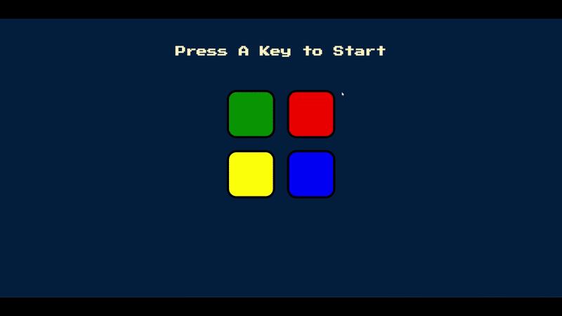

# Welcome to my Simon Says App!

Active Link: https://music-app-jet-two.vercel.app/

## Demo

  
## Overview
A fully interactive Simon Says game inspired by the classic electronic memory challenge. Built using HTML, CSS, JavaScript, and jQuery, this game tests and trains your memory by requiring you to repeat increasingly complex sequences of colors and sounds.

🕹️ Features:
🧠 Pattern-based memory gameplay

⌨️ Press any key to start the game

🎨 Four color buttons (green, red, yellow, blue) with audio and visual feedback

✅ Tracks and verifies user input against the generated sequence

❌ Game over screen with restart functionality

💥 Engaging animations and retro arcade-style fonts

This project highlights DOM manipulation, event handling, animations, and sound integration using JavaScript.
